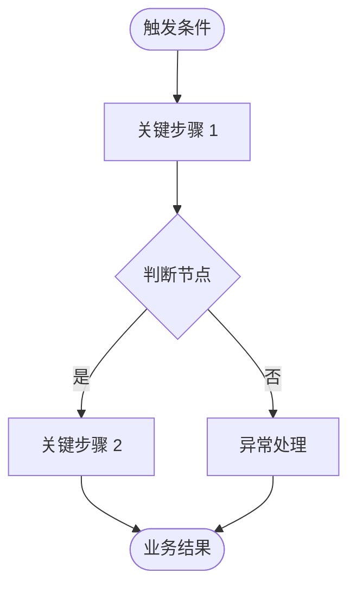

# 需求文档

> 文件路径：`01-需求文档/需求文档.md`（迭代时：`07-需求迭代/{迭代目录}/需求文档/需求文档.md`）
>
> **元信息说明：** 顶部 YAML frontmatter 记录版本、作者、日期、状态与修订记录。迭代修改时递增 `version`、追加 `revision` 条目、更新 `date`。`status` 取值：`draft`（待确认）/ `confirmed`（已确认）。

## 项目名称
[简短、描述性的名称，与 frontmatter `project` 一致]

## 背景与业务价值
- **背景：** [为什么现在要做这件事？触发本需求的痛点/机会/上下文，2-4 句话]
- **业务价值：** [做成之后可衡量的价值，尽量量化。例如：转化率提升 X%、人工成本降低 Y 小时/周、支撑 Z 量级用户]

## 概述
[2-3 句话描述要构建什么]

## 业务流程图

> 用 Mermaid 描述核心业务如何从触发到结果跑通，帮助读者在看细节前建立全局认知。复杂分支可用子图；若有多条独立业务线，可分多个图。

## 目标
- [主要目标]
- [次要目标]

## 目标用户与角色

| 角色 | 描述 | 核心诉求 |
|------|------|----------|
| [角色名，如：普通用户] | [是谁，画像简述] | [想达成什么] |
| [角色名，如：管理员] | [是谁] | [想达成什么] |

## 目标端
- [ ] PC 端
- [ ] 移动端
- [ ] 双端

> 勾选本项目需要覆盖的端。此处声明意图；具体页面归属在需求拆解文档中确认。

## 范围

### 范围内
- [本项目将覆盖的内容]

### 范围外
- [本项目明确不覆盖的内容]

## 用例

### 用例 1：[名称]
- **参与者：** [谁执行此操作，对应"目标用户与角色"中的角色]
- **前置条件：** [此操作发生前必须满足的条件]
- **主流程：**
  1. [步骤 1]
  2. [步骤 2]
- **验收条件：**
  - [可观察/可测试的条目 1，如"提交后页面显示成功提示"]
  - [可观察/可测试的条目 2]

### 用例 2：[名称]
[按需要重复此模式]

## 功能性需求

> 优先级采用 MoSCoW：**必须**（Must have，MVP 必做）/ **应该**（Should have，重要但可延后）/ **可以**（Could have，锦上添花）/ **不会**（Won't have，本次明确不做，记于此以避免遗漏）。

| ID | 需求 | 验收条件 | 优先级 |
|----|------|----------|--------|
| FR-1 | [描述] | [可验收的条目] | 必须/应该/可以/不会 |
| FR-2 | [描述] | [可验收的条目] | 必须/应该/可以/不会 |

## 非功能性需求

| ID | 需求 | 类别 |
|----|------|------|
| NFR-1 | [描述] | 性能/安全/可用性/兼容性/可维护性 |

## 约束与假设

### 约束
- **技术栈：** [必须使用/禁止使用的技术]
- **时间：** [截止日期或里程碑]
- **依赖：** [外部依赖，如必须接入某第三方服务]

### 假设
- [被视为真但未经验证的前提，如"用户已拥有某平台账号"]
- [若假设不成立可能影响范围或方案]

## 依赖与风险

### 依赖
| 依赖项 | 提供方 | 状态 | 备注 |
|--------|--------|------|------|
| [如：OpenAI API key] | [用户/后端] | 待提供/已提供 | [用途] |

### 风险与应对
| 风险 | 可能性 | 影响 | 应对策略 |
|------|--------|------|----------|
| [风险描述] | 高/中/低 | 高/中/低 | [如何缓解或应急] |

## 验收标准

> 此处为**项目整体交付**的衡量标准；单条需求的验收见"功能性需求"表的"验收条件"列。

- [ ] [可衡量的整体标准 1]
- [ ] [可衡量的整体标准 2]

## 术语表

| 术语 | 含义 |
|------|------|
| [领域名词] | [定义，统一团队用语] |

## 待解决问题
- [需要进一步澄清或决策的问题]
